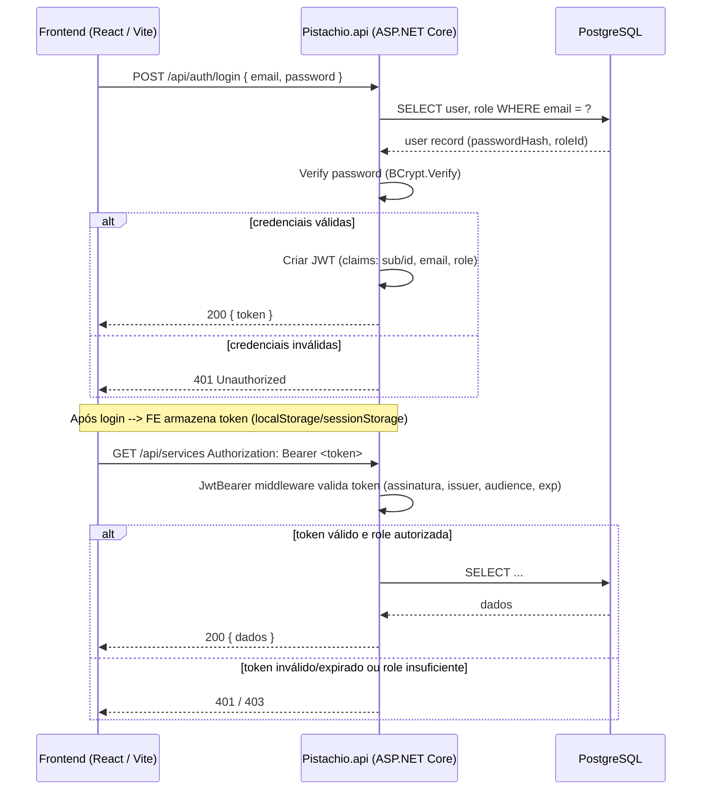

# Diagrama de Autenticação JWT — Pistachio

> **Visão geral:** fluxo de login com JWT entre Frontend (React/Vite), Backend (.NET / Pistachio.api) e PostgreSQL.

---

## 1) Sequence (diagrama de sequência — mermaid)



---

## 2) Component flow (passos resumidos)

1. **Frontend** envia POST `/api/auth/login` com email/senha.
2. **Backend** busca usuário no banco, verifica `PasswordHash` com **BCrypt**.
3. Se OK, backend gera **JWT** assinado (inclui claim `role`) e retorna para frontend.
4. **Frontend** guarda token (localStorage ou sessionStorage) e envia header `Authorization: Bearer <token>` nas chamadas subsequentes.
5. Backend protege endpoints com `[Authorize]` e, quando necessário, com `[Authorize(Roles = "Admin")]`.

---

## 3) Onde guardar a chave JWT (boas práticas)

* **Nunca** comitar chaves reais no repositório.
* Em desenvolvimento, prefira `dotnet user-secrets` (`dotnet user-secrets init` + `dotnet user-secrets set "Jwt:Key" "..."`).
* Em produção, **variáveis de ambiente** ou um gerenciador de segredos (Azure Key Vault, AWS Secrets Manager).
* Manter `appsettings.json` no Git com *configurações não-sensíveis* (Issuer, Audience, ExpiresInHours), deixando `Key` como placeholder.

---

## 4) Como testar (exemplos rápidos)

**Login (curl)**

```bash
curl -X POST http://localhost:5000/api/auth/login \
  -H "Content-Type: application/json" \
  -d '{"email":"admin@pistachio.local","password":"Senha123!"}'
```

**Chamada protegida**

```bash
curl http://localhost:5000/api/services \
  -H "Authorization: Bearer <SEU_TOKEN_AQUI>"
```

Dica: cole o token em [https://jwt.io/](https://jwt.io/) para inspecionar claims (sub, email, role) e exp.

---

## 5) EF Core — quando rodar migrations

* **Criar DTOs/Controllers** → *não* gera migrations.
* **Somente** alterações nas `Models` (entidades) ou no `AppDbContext` exigem `dotnet ef migrations add <Nome>` e `dotnet ef database update`.

Comandos úteis:

```bash
# instale a ferramenta se necessário
dotnet tool install --global dotnet-ef
# adicione design package
dotnet add package Microsoft.EntityFrameworkCore.Design
# criar migration (executar na pasta do projeto que contém o .csproj)
dotnet ef migrations add NomeDaMigracao
# aplicar ao banco
dotnet ef database update
```

---

## 6) Exemplo de arquivo `appsettings.json` seguro para comitar

```json
{
  "Jwt": {
    "Key": "", // NÃO colocar a chave real aqui
    "Issuer": "PistachioBackend",
    "Audience": "PistachioFrontend",
    "ExpiresInHours": 4
  }
}
```

---

## 7) Dicas rápidas extra

* Use `BCrypt.Net-Next` para hash de senhas: `user.PasswordHash = BCrypt.Net.BCrypt.HashPassword(password)`.
* Habilite CORS no backend durante o desenvolvimento (`WithOrigins("http://localhost:5173")` se Vite estiver nessa porta) ou use proxy no Vite.
* Armazenar token em `localStorage` é simples, mas sujeito a XSS. Para produção, considere `HttpOnly` cookies para refresh tokens + access token curto.
* Garanta que *toda* autorização crítica seja verificada no backend (frontend pode ser apenas UX).

---

Se quiser, eu posso:

* Gerar um seed de roles + admin (C#) para você colar no `AppDbContext` ou numa migration;
* Gerar um exemplo pronto de `Program.cs` com leitura via UserSecrets/Environment + CORS + JWT config;
* Gerar o código completo do `AuthController` (com hashing) adaptado ao seu modelo `User` existente.

Diga qual dessas opções prefere — eu gero o código para você colar no `/Pistachio.api`.
